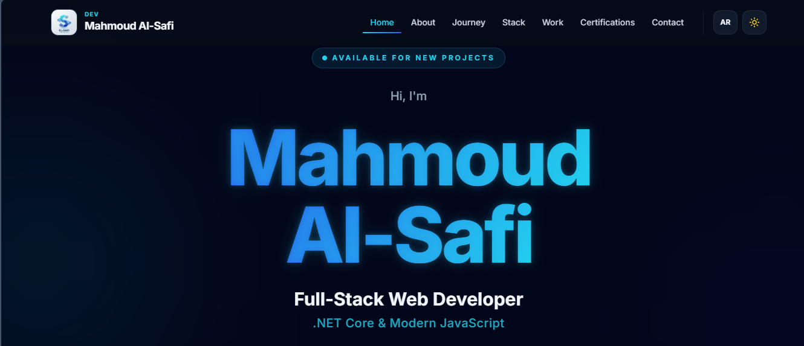

# Assignment: Empty but Live (Ship a Blank Page)

**Track:** General AI Fluency
**Phase:** Build (Week 4)
**Developer:** Mahmoud Mostafa El Safi

---

## 🌐 Live URL

👉 **[View Live Deployment on Vercel](https://mahmoud-mostafa-portfolio.vercel.app/)**

---

## 🎯 Verification & Setup

- **Status:** Live & Reachable online.
- **Platform:** Vercel Hosting connected to GitHub Repository.
- **Tested:** Verified across multiple devices (Desktop & Mobile).
- **Identity Integration:** Incorporates color schemes (`#0F172A`, `#0D9488`) and typography defined in `FL-03 Identity Kit`.

---

## 📸 Verification Screenshot

---

## 📋 Context Assets Ready for Build Week

- ✅ Identity Kit (`FL-03`)
- ✅ Image Curation Guide (`FL-04`)
- ✅ Content & CTA Map (`FL-05`)
