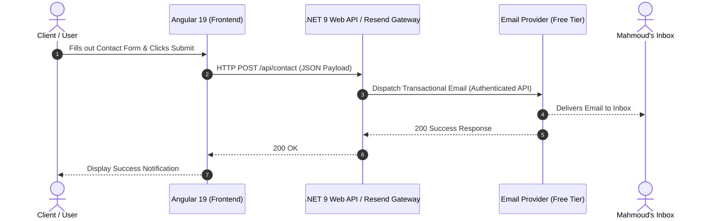

# 📂 FL-06: Make It Do Something (End-to-End Contact Form)

**Track:** FlyRank General AI Fluency (Week 6)
**Developer:** Mahmoud Mostafa El Safi
**Feature:** Dynamic End-to-End Contact Form with Real Email Dispatch

---

## 💡 1. Plain-Words Explanation: What is a Backend & How Data Flows?

- **What is a Backend?**
  If the frontend (Angular) is the storefront and display window that users see and interact with, the backend is the secure private office and engine room. It performs operations that cannot safely happen in the user's browser—like storing API secrets, authenticating requests, validating data, and integrating with third-party email providers.

- **How the Data Flows (End-to-End):**
  1. **User Submission:** The user types their name, email, and message into the Angular reactive form and clicks "Send Message".
  2. **HTTP POST Request:** Angular validates the inputs client-side, creates a JSON payload, and fires an asynchronous `POST` request over HTTPS to the backend API endpoint (`/api/contact`).
  3. **Backend Processing (.NET / Serverless Function):** The API controller receives the payload, verifies that the model is valid, and invokes the email transport service using securely stored credentials.
  4. **Email Delivery (Free-Tier Provider):** The backend contacts the email service (such as Resend / Formspree / SMTP) via an authorized API call.
  5. **Inbox Notification & User Feedback:** The email arrives in my actual inbox, and the API returns a `200 OK` status to the frontend, which displays a success confirmation badge to the user.

---

## 🏗️ 2. Architectural Data Flow Diagram



## 3. Run the implementation

The working implementation lives in `frontend/` and `backend/`.

```bash
# Terminal 1
cd backend
dotnet run --urls http://localhost:5000

# Terminal 2
cd frontend
npm install
npm start
```

Open `http://localhost:4200`. Angular proxies `/api/contact` to the .NET API.

For real email delivery, set these environment variables before starting the API:

```bash
set "Resend__ApiKey=re_xxxxxxxxx"
set "Resend__To=your-inbox@example.com"
dotnet run --urls http://localhost:5000
```

The API accepts `POST /api/contact` with `Name`, `Email`, and `Message`. It validates the payload server-side and keeps the Resend credential out of the browser. Without credentials, development submissions are accepted and logged without dispatching email.
