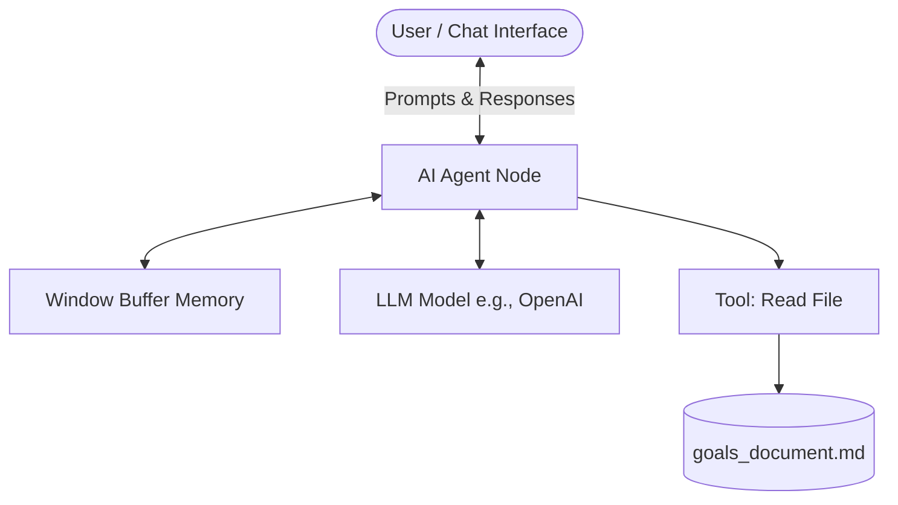

# Weekly Review Assistant (AI Agent)

## 🎯 What the agent does and for whom
The **Weekly Review Assistant** is an AI-powered agent designed for busy professionals, developers, and students. Its primary job is to guide users through a structured "Weekly Review" process. It helps users reflect on their achievements over the past week and plan the upcoming week by cross-referencing their predefined goals. 

## ⚙️ Setup Steps (For Strangers)
To run this agent locally on your machine, follow these steps:

1. **Install n8n:** Install [n8n](https://n8n.io/) locally. You can use npm: 
   ```bash
   npm install n8n -g
   n8n
   ```
2. **Import Workflow:** Open n8n in your browser (usually `http://localhost:5678`). Go to **Workflows** -> **Import from File** and select the `weekly_review_agent.json` file from this folder.
3. **Configure the Knowledge Base:** Open the **Read File** tool node inside the workflow. Update the file path to point to the absolute path of `goals_document.md` on your local machine.
4. **Set API Keys:** Add your LLM credentials (e.g., OpenAI API Key) in n8n and select it in the AI Model node.
5. **Run:** Click **Execute Workflow** or open the **Chat** interface to start talking to the agent!

## 💡 Usage Examples
**User:** "I'm ready for my weekly review."
**Agent:** "Great! Let's get started. I see in your `goals_document.md` that one of your main goals was to finish the backend API. How much progress did you make on that?"
**User:** "I finished the endpoints, but I didn't get time to write the tests."
**Agent:** "That's solid progress! Let's make sure we schedule time for writing those tests next week. What were the main blockers that prevented you from testing?"

## 🏗️ Architecture Sketch
Here is a simple architecture diagram of how the agent operates within n8n:



## 📊 v2 Eval Results
- **Goal Accuracy (5/5):** The agent consistently pulls the correct data from the markdown file without hallucinating non-existent goals.
- **Reflection Quality (4/5):** The AI asks good probing questions, though it occasionally needs to be prompted to move to the "planning" phase.
- **Tool Reliability (5/5):** Reading the local file works 100% of the time seamlessly.

## ⚠️ Limitations
- **No Live API Integrations:** Currently, the agent relies on a local markdown file (`goals_document.md`) instead of integrating directly with dynamic task managers like Todoist, Notion, or Google Calendar due to time constraints for the MVP.
- **Manual Input:** It relies on the user typing out what they did during the week, rather than automatically pulling a list of completed tasks from an external tool.
